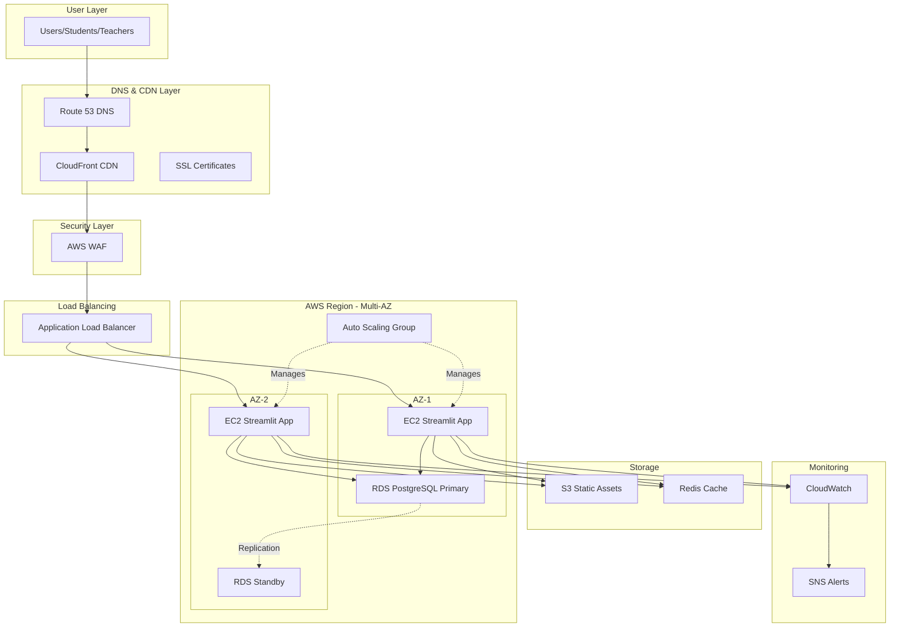
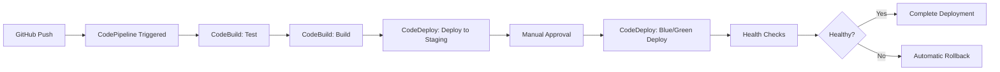

# AWS Production Deployment Plan - SnapClass AI Attendance System

## Executive Summary

This document outlines the production-ready deployment strategy for the SnapClass AI Attendance application on AWS infrastructure, following industry best practices for scalability, security, high availability, and maintainability.

## Table of Contents

1. [Architecture Overview](#architecture-overview)
2. [Technology Stack](#technology-stack)
3. [Infrastructure Components](#infrastructure-components)
4. [Deployment Phases](#deployment-phases)
5. [Security Implementation](#security-implementation)
6. [Monitoring & Alerting](#monitoring--alerting)
7. [CI/CD Pipeline](#cicd-pipeline)
8. [Cost Estimation](#cost-estimation)
9. [Disaster Recovery](#disaster-recovery)

## Architecture Overview

### High-Level Architecture Diagram



### Architecture Principles

- **High Availability**: Multi-AZ deployment with automatic failover
- **Scalability**: Auto-scaling based on CPU/memory metrics
- **Security**: Defense in depth with WAF, security groups, encryption
- **Performance**: CDN caching, Redis for session management
- **Reliability**: Automated backups, health checks, monitoring
- **Cost Optimization**: Right-sized instances, reserved capacity

## Technology Stack

### Application Layer
- **Framework**: Streamlit (Python 3.9+)
- **AI/ML Libraries**: 
  - dlib (face detection)
  - face_recognition (face encoding)
  - librosa (audio processing)
  - resemblyzer (voice recognition)
  - scikit-learn (SVM classifier)

### Infrastructure Layer
- **Compute**: EC2 t3.large instances (2 vCPU, 8GB RAM)
- **Database**: RDS PostgreSQL 14.x (Multi-AZ, db.t3.medium)
- **Load Balancer**: Application Load Balancer (ALB)
- **CDN**: CloudFront with edge locations
- **Storage**: S3 Standard for assets, S3 Intelligent-Tiering for backups
- **Cache**: ElastiCache Redis 7.x (cache.t3.micro)
- **DNS**: Route 53 with health checks

### DevOps Tools
- **IaC**: Terraform for infrastructure provisioning
- **CI/CD**: AWS CodePipeline, CodeBuild, CodeDeploy
- **Monitoring**: CloudWatch, CloudWatch Logs, X-Ray
- **Secrets**: AWS Systems Manager Parameter Store, Secrets Manager
- **Version Control**: GitHub with branch protection

## Infrastructure Components

### 1. Network Architecture

#### VPC Configuration
```
VPC CIDR: 10.0.0.0/16
- Public Subnet AZ-1: 10.0.1.0/24
- Public Subnet AZ-2: 10.0.2.0/24
- Private Subnet AZ-1: 10.0.11.0/24
- Private Subnet AZ-2: 10.0.12.0/24
- Database Subnet AZ-1: 10.0.21.0/24
- Database Subnet AZ-2: 10.0.22.0/24
```

#### Security Groups

**ALB Security Group**
- Inbound: 443 (HTTPS) from 0.0.0.0/0
- Inbound: 80 (HTTP) from 0.0.0.0/0 (redirect to HTTPS)
- Outbound: All traffic to EC2 security group

**EC2 Security Group**
- Inbound: 8501 (Streamlit) from ALB security group
- Inbound: 22 (SSH) from bastion host only
- Outbound: 5432 to RDS security group
- Outbound: 443 to internet (for updates)
- Outbound: 6379 to ElastiCache

**RDS Security Group**
- Inbound: 5432 from EC2 security group
- Outbound: None required

**ElastiCache Security Group**
- Inbound: 6379 from EC2 security group
- Outbound: None required

### 2. Compute Resources

#### EC2 Instance Specifications
- **Instance Type**: t3.large (2 vCPU, 8GB RAM)
- **AMI**: Amazon Linux 2023 (custom AMI with dependencies)
- **Storage**: 50GB GP3 SSD
- **IAM Role**: EC2-SnapClass-Role with necessary permissions

#### Auto Scaling Configuration
```
Minimum Instances: 2
Desired Instances: 2
Maximum Instances: 6

Scaling Policies:
- Scale Up: CPU > 70% for 2 minutes
- Scale Down: CPU < 30% for 5 minutes
- Target Tracking: 60% CPU utilization
```

### 3. Database Configuration

#### RDS PostgreSQL Setup
```
Engine: PostgreSQL 14.x
Instance Class: db.t3.medium (2 vCPU, 4GB RAM)
Storage: 100GB GP3 SSD (Auto-scaling enabled up to 500GB)
Multi-AZ: Enabled
Backup Retention: 7 days
Backup Window: 03:00-04:00 UTC
Maintenance Window: Sun 04:00-05:00 UTC
Encryption: Enabled (AWS KMS)
Performance Insights: Enabled
Enhanced Monitoring: Enabled (60-second granularity)
```

#### Database Schema Migration
The application currently uses Supabase. Migration steps:
1. Export Supabase schema and data
2. Create equivalent PostgreSQL schema in RDS
3. Migrate data using pg_dump/pg_restore
4. Update application connection strings
5. Test thoroughly before cutover

### 4. Storage Solutions

#### S3 Bucket Structure
```
snapclass-prod-assets/
├── static/              # Application static files
├── uploads/             # User uploaded images
│   ├── faces/          # Face recognition images
│   └── temp/           # Temporary processing files
├── backups/            # Application backups
└── logs/               # Application logs archive
```

#### S3 Configuration
- **Versioning**: Enabled
- **Encryption**: AES-256 (SSE-S3)
- **Lifecycle Policies**:
  - Move temp files to Glacier after 7 days
  - Delete temp files after 30 days
  - Move logs to Intelligent-Tiering after 30 days
- **CORS**: Configured for application domain
- **Access**: Private with CloudFront OAI

### 5. Caching Layer

#### ElastiCache Redis Configuration
```
Engine: Redis 7.x
Node Type: cache.t3.micro
Number of Nodes: 2 (Primary + Replica)
Multi-AZ: Enabled
Automatic Failover: Enabled
Encryption in Transit: Enabled
Encryption at Rest: Enabled
```

#### Cache Strategy
- Session data: TTL 24 hours
- ML model cache: TTL 1 hour
- Student data: TTL 30 minutes
- Subject data: TTL 1 hour

## Deployment Phases

### Phase 1: Infrastructure Setup (Week 1)

#### Day 1-2: Network & Security Foundation
1. Create VPC with public/private subnets across 2 AZs
2. Configure Internet Gateway and NAT Gateways
3. Set up Route Tables
4. Create Security Groups
5. Configure Network ACLs
6. Set up VPC Flow Logs

#### Day 3-4: Database Setup
1. Create RDS PostgreSQL instance (Multi-AZ)
2. Configure parameter groups for optimization
3. Set up automated backups
4. Create read replica (optional for reporting)
5. Configure CloudWatch alarms for RDS
6. Test database connectivity

#### Day 5: Storage & Caching
1. Create S3 buckets with proper policies
2. Configure S3 lifecycle rules
3. Set up ElastiCache Redis cluster
4. Configure Redis parameter groups
5. Test cache connectivity

### Phase 2: Application Deployment (Week 2)

#### Day 1-2: Custom AMI Creation
1. Launch base EC2 instance (Amazon Linux 2023)
2. Install system dependencies:
   ```bash
   sudo yum update -y
   sudo yum install -y python3.9 python3-pip git
   sudo yum install -y cmake gcc gcc-c++ make
   sudo yum install -y libX11-devel libXext-devel
   ```
3. Install Python dependencies:
   ```bash
   pip3 install -r requirements.txt
   ```
4. Install CloudWatch agent
5. Configure application startup scripts
6. Create custom AMI

#### Day 3: Load Balancer & Auto Scaling
1. Create Application Load Balancer
2. Configure target groups
3. Set up health checks (path: /healthz)
4. Create launch template with custom AMI
5. Configure Auto Scaling Group
6. Test scaling policies

#### Day 4-5: Application Configuration
1. Migrate database schema from Supabase to RDS
2. Update application configuration:
   - Database connection strings
   - S3 bucket references
   - Redis connection
   - Environment variables
3. Deploy application to EC2 instances
4. Configure application logging
5. Test application functionality

### Phase 3: Security & SSL (Week 3)

#### Day 1-2: SSL/TLS Configuration
1. Request SSL certificate in ACM for your domain
2. Validate domain ownership
3. Configure ALB listener for HTTPS (port 443)
4. Set up HTTP to HTTPS redirect
5. Configure SSL policies (TLS 1.2+)

#### Day 2-3: DNS Configuration
1. Create Route 53 hosted zone
2. Configure A record pointing to ALB
3. Set up health checks
4. Configure failover routing (if multi-region)
5. Update domain registrar nameservers

#### Day 4-5: WAF & Security Hardening
1. Create WAF Web ACL
2. Configure WAF rules:
   - Rate limiting (1000 requests/5 min per IP)
   - SQL injection protection
   - XSS protection
   - Geographic restrictions (if needed)
   - Known bad inputs blocking
3. Associate WAF with ALB
4. Configure AWS Shield Standard
5. Set up Security Hub

### Phase 4: Monitoring & CI/CD (Week 4)

#### Day 1-2: Monitoring Setup
1. Create CloudWatch dashboards
2. Configure CloudWatch alarms:
   - EC2 CPU > 80%
   - RDS CPU > 80%
   - RDS storage < 20%
   - ALB 5xx errors > 10
   - Application errors
3. Set up CloudWatch Logs
4. Configure log retention policies
5. Create SNS topics for alerts
6. Configure email/SMS notifications

#### Day 3-5: CI/CD Pipeline
1. Set up GitHub repository webhooks
2. Create CodePipeline:
   - Source: GitHub
   - Build: CodeBuild
   - Deploy: CodeDeploy
3. Configure CodeBuild:
   - Run tests
   - Build application
   - Create deployment package
4. Configure CodeDeploy:
   - Blue/Green deployment
   - Automatic rollback on failure
5. Test complete pipeline

## Security Implementation

### 1. Identity & Access Management

#### IAM Roles

**EC2 Instance Role (EC2-SnapClass-Role)**
```json
Permissions:
- S3: Read/Write to snapclass-prod-assets
- RDS: Connect using IAM authentication
- CloudWatch: PutMetricData, PutLogEvents
- Systems Manager: GetParameter, GetParameters
- Secrets Manager: GetSecretValue
- ElastiCache: DescribeCacheClusters
```

**CodeDeploy Service Role**
```json
Permissions:
- EC2: Describe, Create, Delete instances
- Auto Scaling: Describe, Update groups
- ELB: Describe, Register, Deregister targets
- S3: GetObject from deployment bucket
```

**CodeBuild Service Role**
```json
Permissions:
- S3: GetObject, PutObject
- CloudWatch Logs: CreateLogGroup, PutLogEvents
- ECR: GetAuthorizationToken, BatchCheckLayerAvailability
```

### 2. Secrets Management

#### AWS Systems Manager Parameter Store
```
/snapclass/prod/db/host
/snapclass/prod/db/port
/snapclass/prod/db/name
/snapclass/prod/redis/endpoint
/snapclass/prod/s3/bucket
/snapclass/prod/app/secret_key
```

#### AWS Secrets Manager
```
snapclass/prod/db/credentials (auto-rotation enabled)
snapclass/prod/api/keys
```

### 3. Network Security

#### Security Best Practices
- EC2 instances in private subnets only
- RDS in isolated database subnets
- No direct internet access to application servers
- All traffic through ALB
- VPC Flow Logs enabled
- GuardDuty enabled for threat detection

### 4. Data Encryption

#### Encryption at Rest
- RDS: AWS KMS encryption
- S3: SSE-S3 or SSE-KMS
- EBS: Encrypted volumes
- ElastiCache: Encryption at rest enabled

#### Encryption in Transit
- ALB: TLS 1.2+ only
- RDS: SSL/TLS connections required
- ElastiCache: TLS enabled
- S3: HTTPS only

## Monitoring & Alerting

### CloudWatch Metrics

#### Application Metrics
- Request count per minute
- Response time (p50, p95, p99)
- Error rate (4xx, 5xx)
- Active user sessions
- Face recognition processing time
- Voice recognition processing time

#### Infrastructure Metrics
- EC2 CPU utilization
- EC2 memory utilization
- EC2 disk I/O
- RDS CPU utilization
- RDS connections
- RDS read/write latency
- ALB request count
- ALB target response time
- ElastiCache CPU, memory, connections

### CloudWatch Alarms

#### Critical Alarms (Immediate Action)
```
1. RDS CPU > 90% for 5 minutes
2. RDS storage < 10%
3. ALB 5xx errors > 50 in 5 minutes
4. No healthy targets in target group
5. RDS connection failures
6. Application crashes (no heartbeat)
```

#### Warning Alarms (Investigation Needed)
```
1. EC2 CPU > 70% for 10 minutes
2. RDS CPU > 70% for 10 minutes
3. ALB 4xx errors > 100 in 5 minutes
4. Response time > 3 seconds (p95)
5. Disk usage > 80%
6. Memory usage > 80%
```

### Logging Strategy

#### Application Logs
```
Location: /var/log/snapclass/
- application.log (INFO level)
- error.log (ERROR level)
- access.log (all requests)
- performance.log (timing metrics)

Retention: 
- CloudWatch Logs: 30 days
- S3 Archive: 1 year
```

#### System Logs
```
- /var/log/messages (system events)
- /var/log/secure (authentication)
- VPC Flow Logs (network traffic)
- ALB Access Logs (HTTP requests)
```

## CI/CD Pipeline

### Pipeline Architecture



### Deployment Strategy

#### Blue/Green Deployment
1. New version deployed to "Green" environment
2. Health checks performed on Green
3. Traffic gradually shifted: 10% → 50% → 100%
4. Monitor metrics during shift
5. Automatic rollback if errors detected
6. Keep Blue environment for 1 hour before termination

### Build Process

#### buildspec.yml
```yaml
version: 0.2

phases:
  pre_build:
    commands:
      - echo Installing dependencies...
      - pip install -r requirements.txt
      - pip install pytest pytest-cov flake8
  
  build:
    commands:
      - echo Running tests...
      - pytest tests/ --cov=src --cov-report=xml
      - echo Running linter...
      - flake8 src/ --max-line-length=120
      - echo Build completed
  
  post_build:
    commands:
      - echo Creating deployment package...
      - zip -r deployment.zip . -x "*.git*" "tests/*" "*.pyc"

artifacts:
  files:
    - deployment.zip
    - appspec.yml
    - scripts/**/*
```

### Deployment Scripts

#### appspec.yml
```yaml
version: 0.0
os: linux

files:
  - source: /
    destination: /opt/snapclass

hooks:
  BeforeInstall:
    - location: scripts/before_install.sh
      timeout: 300
  
  AfterInstall:
    - location: scripts/after_install.sh
      timeout: 300
  
  ApplicationStart:
    - location: scripts/start_application.sh
      timeout: 300
  
  ValidateService:
    - location: scripts/validate_service.sh
      timeout: 300
```

## Cost Estimation

### Monthly Cost Breakdown (USD)

#### Compute
```
EC2 Instances (2x t3.large, on-demand):
  2 × $0.0832/hour × 730 hours = $121.47

Auto Scaling (average 1 additional instance, 50% time):
  1 × $0.0832/hour × 365 hours = $30.37

Total Compute: $151.84/month
```

#### Database
```
RDS PostgreSQL (db.t3.medium, Multi-AZ):
  $0.136/hour × 730 hours × 2 = $198.56

Storage (100GB GP3):
  $0.138/GB × 100GB = $13.80

Backup Storage (100GB):
  $0.095/GB × 100GB = $9.50

Total Database: $221.86/month
```

#### Storage & CDN
```
S3 Storage (500GB):
  $0.023/GB × 500GB = $11.50

S3 Requests (1M PUT, 10M GET):
  $0.005/1000 PUT × 1000 + $0.0004/1000 GET × 10000 = $9.00

CloudFront (1TB transfer):
  $0.085/GB × 1000GB = $85.00

Total Storage & CDN: $105.50/month
```

#### Load Balancing & Networking
```
Application Load Balancer:
  $0.0225/hour × 730 hours = $16.43

LCU Hours (estimated 10 LCU average):
  $0.008/LCU × 10 × 730 = $58.40

Data Transfer Out (500GB):
  $0.09/GB × 500GB = $45.00

Total Networking: $119.83/month
```

#### Caching
```
ElastiCache Redis (cache.t3.micro × 2):
  2 × $0.017/hour × 730 hours = $24.82

Total Caching: $24.82/month
```

#### Monitoring & Security
```
CloudWatch Logs (50GB ingestion):
  $0.50/GB × 50GB = $25.00

CloudWatch Metrics (custom metrics):
  $0.30/metric × 50 metrics = $15.00

WAF (1M requests):
  $5.00 + $1.00/million × 1 = $6.00

Total Monitoring: $46.00/month
```

#### CI/CD
```
CodePipeline (1 active pipeline):
  $1.00/pipeline = $1.00

CodeBuild (100 build minutes):
  $0.005/minute × 100 = $0.50

Total CI/CD: $1.50/month
```

### Total Monthly Cost
```
Compute:              $151.84
Database:             $221.86
Storage & CDN:        $105.50
Networking:           $119.83
Caching:              $24.82
Monitoring:           $46.00
CI/CD:                $1.50
------------------------
TOTAL:                $671.35/month
```

### Cost Optimization Strategies

1. **Reserved Instances**: Save 30-40% on EC2 and RDS with 1-year commitment
2. **Savings Plans**: Flexible commitment for compute resources
3. **S3 Intelligent-Tiering**: Automatic cost optimization for storage
4. **CloudFront Reserved Capacity**: Save on CDN costs
5. **Right-sizing**: Monitor and adjust instance sizes based on actual usage
6. **Scheduled Scaling**: Scale down during off-peak hours
7. **Spot Instances**: Use for non-critical workloads (testing, batch processing)

**Estimated Savings with Optimization**: 35-45% ($235-300/month)
**Optimized Monthly Cost**: $370-435/month

## Disaster Recovery

### Backup Strategy

#### RDS Automated Backups
```
Frequency: Daily
Retention: 7 days
Backup Window: 03:00-04:00 UTC
Point-in-Time Recovery: Enabled (up to 5 minutes)
Cross-Region Backup: Enabled (for critical data)
```

#### Application Backups
```
S3 Versioning: Enabled
S3 Cross-Region Replication: Enabled
Configuration Backups: Daily to S3
AMI Snapshots: Weekly
```

#### Recovery Time Objectives (RTO)
```
Database Failure: < 5 minutes (automatic failover)
Application Server Failure: < 2 minutes (auto-scaling)
Availability Zone Failure: < 5 minutes (multi-AZ)
Region Failure: < 1 hour (manual failover)
Data Corruption: < 4 hours (restore from backup)
```

#### Recovery Point Objectives (RPO)
```
Database: < 5 minutes (continuous replication)
Application State: < 1 hour (Redis persistence)
User Uploads: < 15 minutes (S3 replication)
Configuration: < 24 hours (daily backups)
```

### Disaster Recovery Procedures

#### Scenario 1: EC2 Instance Failure
```
1. Auto Scaling detects unhealthy instance
2. Terminates failed instance
3. Launches replacement from launch template
4. Registers with target group
5. Begins receiving traffic
Duration: 2-3 minutes (automatic)
```

#### Scenario 2: RDS Primary Failure
```
1. RDS detects primary failure
2. Promotes standby to primary
3. Updates DNS endpoint
4. Application reconnects automatically
Duration: 3-5 minutes (automatic)
```

#### Scenario 3: Availability Zone Failure
```
1. Health checks fail for all resources in AZ
2. ALB stops routing to affected AZ
3. Auto Scaling launches instances in healthy AZ
4. RDS fails over to standby in healthy AZ
Duration: 5-10 minutes (automatic)
```

#### Scenario 4: Complete Region Failure
```
1. Monitor detects region-wide issues
2. Update Route 53 to point to DR region
3. Restore latest RDS snapshot in DR region
4. Launch EC2 instances from AMI
5. Update application configuration
6. Validate functionality
Duration: 30-60 minutes (manual intervention required)
```

### Testing Schedule

```
Monthly: Backup restoration test
Quarterly: Failover test (RDS, EC2)
Bi-annually: Full DR drill (region failover)
Annually: Disaster recovery tabletop exercise
```

## Implementation Checklist

### Pre-Deployment
- [ ] AWS account configured with billing alerts
- [ ] Domain name ready and accessible
- [ ] SSL certificate requirements understood
- [ ] Team trained on AWS services
- [ ] Budget approved
- [ ] Backup of current Supabase data

### Week 1: Infrastructure
- [ ] VPC and subnets created
- [ ] Security groups configured
- [ ] RDS PostgreSQL deployed
- [ ] S3 buckets created
- [ ] ElastiCache Redis deployed
- [ ] IAM roles and policies created

### Week 2: Application
- [ ] Custom AMI created with dependencies
- [ ] Application Load Balancer configured
- [ ] Auto Scaling Group deployed
- [ ] Database schema migrated
- [ ] Application deployed and tested
- [ ] Health checks passing

### Week 3: Security
- [ ] SSL certificate issued and validated
- [ ] HTTPS configured on ALB
- [ ] Route 53 DNS configured
- [ ] WAF rules implemented
- [ ] Security groups reviewed
- [ ] Secrets migrated to Parameter Store

### Week 4: Operations
- [ ] CloudWatch dashboards created
- [ ] Alarms configured and tested
- [ ] SNS notifications working
- [ ] CI/CD pipeline deployed
- [ ] Deployment tested end-to-end
- [ ] Documentation completed

### Post-Deployment
- [ ] Load testing performed
- [ ] Security audit completed
- [ ] Backup restoration tested
- [ ] Monitoring validated
- [ ] Team handoff completed
- [ ] Go-live checklist signed off

## Next Steps

1. **Review this plan** with your team and stakeholders
2. **Adjust configurations** based on your specific requirements
3. **Prepare AWS account** with necessary permissions
4. **Switch to Code mode** to begin implementation
5. **Follow the deployment phases** systematically
6. **Test thoroughly** at each stage
7. **Document any deviations** from the plan

## Support & Maintenance

### Ongoing Tasks
- Weekly: Review CloudWatch metrics and optimize
- Monthly: Security patches and updates
- Quarterly: Cost optimization review
- Annually: Architecture review and capacity planning

### Escalation Path
```
Level 1: CloudWatch Alarms → On-call Engineer
Level 2: Critical Issues → DevOps Lead
Level 3: Service Outage → Engineering Manager
Level 4: Data Loss/Security → CTO/CISO
```

---

**Document Version**: 1.0  
**Last Updated**: 2026-09-25  
**Author**: AWS Deployment Planning Team  
**Status**: Ready for Review