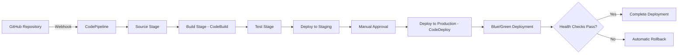

# CI/CD Pipeline Setup Guide - SnapClass AI Attendance

This guide covers setting up a complete CI/CD pipeline using AWS CodePipeline, CodeBuild, and CodeDeploy for automated deployments.

## Pipeline Architecture



## Prerequisites

- GitHub repository with application code
- AWS infrastructure deployed
- IAM roles configured
- S3 bucket for artifacts

## Phase 1: Prepare Repository

### Step 1: Create buildspec.yml

Create [`buildspec.yml`](buildspec.yml) in repository root:

```yaml
version: 0.2

env:
  variables:
    PYTHON_VERSION: "3.9"
  parameter-store:
    DB_HOST: /snapclass/prod/db/host
    DB_PORT: /snapclass/prod/db/port
    DB_NAME: /snapclass/prod/db/name

phases:
  install:
    runtime-versions:
      python: 3.9
    commands:
      - echo "Installing dependencies..."
      - pip install --upgrade pip
      - pip install -r requirements.txt
      - pip install pytest pytest-cov flake8 black mypy

  pre_build:
    commands:
      - echo "Running code quality checks..."
      - black --check src/ app.py
      - flake8 src/ app.py --max-line-length=120 --exclude=venv
      - mypy src/ --ignore-missing-imports
      - echo "Running tests..."
      - pytest tests/ -v --cov=src --cov-report=xml --cov-report=html
      - echo "Test coverage report generated"

  build:
    commands:
      - echo "Build started on `date`"
      - echo "Creating deployment package..."
      - mkdir -p build
      - cp -r src build/
      - cp app.py build/
      - cp requirements.txt build/
      - cp -r .streamlit build/ || true
      - echo "Build completed on `date`"

  post_build:
    commands:
      - echo "Creating deployment archive..."
      - cd build
      - zip -r ../deployment.zip . -x "*.git*" "*.pyc" "__pycache__/*" "tests/*"
      - cd ..
      - echo "Deployment package created"
      - ls -lh deployment.zip

artifacts:
  files:
    - deployment.zip
    - appspec.yml
    - scripts/**/*
  name: SnapClassBuild-$(date +%Y%m%d-%H%M%S)

reports:
  coverage:
    files:
      - coverage.xml
    file-format: COBERTURAXML

cache:
  paths:
    - '/root/.cache/pip/**/*'
```

### Step 2: Create appspec.yml

Create [`appspec.yml`](appspec.yml) for CodeDeploy:

```yaml
version: 0.0
os: linux
files:
  - source: /
    destination: /opt/snapclass/releases/current
    
permissions:
  - object: /opt/snapclass
    owner: ec2-user
    group: ec2-user
    mode: 755
    type:
      - directory
  - object: /opt/snapclass/releases
    owner: ec2-user
    group: ec2-user
    mode: 755
    type:
      - directory

hooks:
  ApplicationStop:
    - location: scripts/stop_application.sh
      timeout: 300
      runas: ec2-user

  BeforeInstall:
    - location: scripts/before_install.sh
      timeout: 300
      runas: ec2-user

  AfterInstall:
    - location: scripts/after_install.sh
      timeout: 600
      runas: ec2-user

  ApplicationStart:
    - location: scripts/start_application.sh
      timeout: 300
      runas: ec2-user

  ValidateService:
    - location: scripts/validate_service.sh
      timeout: 300
      runas: ec2-user
```

### Step 3: Create Deployment Scripts

Create [`scripts/stop_application.sh`](scripts/stop_application.sh):

```bash
#!/bin/bash
set -e

echo "Stopping SnapClass application..."

# Stop services gracefully
sudo systemctl stop snapclass.service || true
sudo systemctl stop snapclass-health.service || true

# Wait for processes to stop
sleep 5

echo "Application stopped successfully"
```

Create [`scripts/before_install.sh`](scripts/before_install.sh):

```bash
#!/bin/bash
set -e

echo "Preparing for installation..."

# Create releases directory if not exists
mkdir -p /opt/snapclass/releases

# Backup current release
if [ -d "/opt/snapclass/releases/current" ]; then
    TIMESTAMP=$(date +%Y%m%d-%H%M%S)
    mv /opt/snapclass/releases/current /opt/snapclass/releases/backup-$TIMESTAMP
    echo "Current release backed up to backup-$TIMESTAMP"
fi

# Clean old backups (keep last 3)
cd /opt/snapclass/releases
ls -t | grep backup | tail -n +4 | xargs -r rm -rf

echo "Pre-installation completed"
```

Create [`scripts/after_install.sh`](scripts/after_install.sh):

```bash
#!/bin/bash
set -e

echo "Configuring application..."

cd /opt/snapclass/releases/current

# Extract deployment package
if [ -f "deployment.zip" ]; then
    unzip -o deployment.zip
    rm deployment.zip
fi

# Activate virtual environment
source /opt/snapclass/venv/bin/activate

# Install/update dependencies
pip install -r requirements.txt --quiet

# Load configuration from Parameter Store
source /opt/snapclass/scripts/load_config.sh

# Run database migrations if needed
# python scripts/migrate.py

# Set proper permissions
chmod +x /opt/snapclass/scripts/*.sh

# Create log directory if not exists
sudo mkdir -p /var/log/snapclass
sudo chown ec2-user:ec2-user /var/log/snapclass

echo "Post-installation configuration completed"
```

Create [`scripts/start_application.sh`](scripts/start_application.sh):

```bash
#!/bin/bash
set -e

echo "Starting SnapClass application..."

# Start health check service first
sudo systemctl start snapclass-health.service

# Wait for health check to be ready
sleep 3

# Start main application
sudo systemctl start snapclass.service

# Wait for application to start
sleep 10

echo "Application started successfully"
```

Create [`scripts/validate_service.sh`](scripts/validate_service.sh):

```bash
#!/bin/bash
set -e

echo "Validating service..."

# Check if services are running
if ! sudo systemctl is-active --quiet snapclass.service; then
    echo "ERROR: SnapClass service is not running"
    exit 1
fi

if ! sudo systemctl is-active --quiet snapclass-health.service; then
    echo "ERROR: Health check service is not running"
    exit 1
fi

# Test health endpoint
MAX_RETRIES=10
RETRY_COUNT=0

while [ $RETRY_COUNT -lt $MAX_RETRIES ]; do
    if curl -f http://localhost:8502/healthz > /dev/null 2>&1; then
        echo "Health check passed"
        break
    fi
    
    RETRY_COUNT=$((RETRY_COUNT + 1))
    echo "Health check attempt $RETRY_COUNT/$MAX_RETRIES failed, retrying..."
    sleep 5
done

if [ $RETRY_COUNT -eq $MAX_RETRIES ]; then
    echo "ERROR: Health check failed after $MAX_RETRIES attempts"
    exit 1
fi

# Test application endpoint
if curl -f http://localhost:8501 > /dev/null 2>&1; then
    echo "Application endpoint is responding"
else
    echo "WARNING: Application endpoint not responding, but health check passed"
fi

echo "Service validation completed successfully"
exit 0
```

Make scripts executable:

```bash
chmod +x scripts/*.sh
```

### Step 4: Create Test Suite

Create [`tests/test_basic.py`](tests/test_basic.py):

```python
import pytest
import sys
import os

# Add src to path
sys.path.insert(0, os.path.abspath(os.path.join(os.path.dirname(__file__), '..')))

def test_imports():
    """Test that critical modules can be imported"""
    try:
        import streamlit
        import dlib
        import numpy
        import pandas
        assert True
    except ImportError as e:
        pytest.fail(f"Failed to import required module: {e}")

def test_database_config():
    """Test database configuration structure"""
    from src.database import config
    assert hasattr(config, 'supabase') or True  # Will be updated for RDS

def test_face_pipeline():
    """Test face recognition pipeline imports"""
    from src.pipelines import face_pipeline
    assert hasattr(face_pipeline, 'get_face_embeddings')
    assert hasattr(face_pipeline, 'load_dlib_models')

def test_voice_pipeline():
    """Test voice recognition pipeline imports"""
    from src.pipelines import voice_pipeline
    assert True  # Add actual tests based on your implementation

def test_app_structure():
    """Test main app structure"""
    import app
    assert hasattr(app, 'main')
```

## Phase 2: Set Up CodeBuild

### Step 1: Create S3 Bucket for Artifacts

```bash
aws s3api create-bucket \
  --bucket snapclass-cicd-artifacts-<unique-suffix> \
  --region us-east-1

# Enable versioning
aws s3api put-bucket-versioning \
  --bucket snapclass-cicd-artifacts-<unique-suffix> \
  --versioning-configuration Status=Enabled

# Enable encryption
aws s3api put-bucket-encryption \
  --bucket snapclass-cicd-artifacts-<unique-suffix> \
  --server-side-encryption-configuration '{
    "Rules": [{
      "ApplyServerSideEncryptionByDefault": {
        "SSEAlgorithm": "AES256"
      }
    }]
  }'
```

### Step 2: Create CodeBuild IAM Role

```bash
# Create trust policy
cat > codebuild-trust-policy.json << EOF
{
  "Version": "2012-10-17",
  "Statement": [
    {
      "Effect": "Allow",
      "Principal": {
        "Service": "codebuild.amazonaws.com"
      },
      "Action": "sts:AssumeRole"
    }
  ]
}
EOF

# Create role
aws iam create-role \
  --role-name SnapClass-CodeBuild-Role \
  --assume-role-policy-document file://codebuild-trust-policy.json

# Create policy
cat > codebuild-policy.json << EOF
{
  "Version": "2012-10-17",
  "Statement": [
    {
      "Effect": "Allow",
      "Action": [
        "logs:CreateLogGroup",
        "logs:CreateLogStream",
        "logs:PutLogEvents"
      ],
      "Resource": "arn:aws:logs:*:*:*"
    },
    {
      "Effect": "Allow",
      "Action": [
        "s3:GetObject",
        "s3:PutObject"
      ],
      "Resource": "arn:aws:s3:::snapclass-cicd-artifacts-*/*"
    },
    {
      "Effect": "Allow",
      "Action": [
        "ssm:GetParameter",
        "ssm:GetParameters"
      ],
      "Resource": "arn:aws:ssm:*:*:parameter/snapclass/*"
    },
    {
      "Effect": "Allow",
      "Action": [
        "codebuild:CreateReportGroup",
        "codebuild:CreateReport",
        "codebuild:UpdateReport",
        "codebuild:BatchPutTestCases"
      ],
      "Resource": "arn:aws:codebuild:*:*:report-group/*"
    }
  ]
}
EOF

aws iam put-role-policy \
  --role-name SnapClass-CodeBuild-Role \
  --policy-name SnapClass-CodeBuild-Policy \
  --policy-document file://codebuild-policy.json
```

### Step 3: Create CodeBuild Project

```bash
aws codebuild create-project \
  --name snapclass-build \
  --description "Build project for SnapClass application" \
  --source type=GITHUB,location=https://github.com/yourusername/yourrepo.git \
  --artifacts type=S3,location=snapclass-cicd-artifacts-<unique-suffix> \
  --environment type=LINUX_CONTAINER,image=aws/codebuild/standard:5.0,computeType=BUILD_GENERAL1_MEDIUM \
  --service-role arn:aws:iam::<account-id>:role/SnapClass-CodeBuild-Role \
  --cache type=S3,location=snapclass-cicd-artifacts-<unique-suffix>/cache \
  --tags Key=Name,Value=snapclass-build Key=Environment,Value=production
```

## Phase 3: Set Up CodeDeploy

### Step 1: Create CodeDeploy IAM Role

```bash
# Create trust policy
cat > codedeploy-trust-policy.json << EOF
{
  "Version": "2012-10-17",
  "Statement": [
    {
      "Effect": "Allow",
      "Principal": {
        "Service": "codedeploy.amazonaws.com"
      },
      "Action": "sts:AssumeRole"
    }
  ]
}
EOF

# Create role
aws iam create-role \
  --role-name SnapClass-CodeDeploy-Role \
  --assume-role-policy-document file://codedeploy-trust-policy.json

# Attach AWS managed policy
aws iam attach-role-policy \
  --role-name SnapClass-CodeDeploy-Role \
  --policy-arn arn:aws:iam::aws:policy/AWSCodeDeployRole
```

### Step 2: Create CodeDeploy Application

```bash
aws deploy create-application \
  --application-name SnapClass \
  --compute-platform Server
```

### Step 3: Create Deployment Group

```bash
aws deploy create-deployment-group \
  --application-name SnapClass \
  --deployment-group-name SnapClass-Production \
  --deployment-config-name CodeDeployDefault.AllAtOnce \
  --service-role-arn arn:aws:iam::<account-id>:role/SnapClass-CodeDeploy-Role \
  --auto-scaling-groups snapclass-asg \
  --deployment-style deploymentType=BLUE_GREEN,deploymentOption=WITH_TRAFFIC_CONTROL \
  --blue-green-deployment-configuration '{
    "terminateBlueInstancesOnDeploymentSuccess": {
      "action": "TERMINATE",
      "terminationWaitTimeInMinutes": 60
    },
    "deploymentReadyOption": {
      "actionOnTimeout": "CONTINUE_DEPLOYMENT"
    },
    "greenFleetProvisioningOption": {
      "action": "COPY_AUTO_SCALING_GROUP"
    }
  }' \
  --load-balancer-info targetGroupInfoList=[{name=snapclass-tg}] \
  --auto-rollback-configuration enabled=true,events=DEPLOYMENT_FAILURE,DEPLOYMENT_STOP_ON_ALARM
```

## Phase 4: Set Up CodePipeline

### Step 1: Create CodePipeline IAM Role

```bash
# Create trust policy
cat > codepipeline-trust-policy.json << EOF
{
  "Version": "2012-10-17",
  "Statement": [
    {
      "Effect": "Allow",
      "Principal": {
        "Service": "codepipeline.amazonaws.com"
      },
      "Action": "sts:AssumeRole"
    }
  ]
}
EOF

# Create role
aws iam create-role \
  --role-name SnapClass-CodePipeline-Role \
  --assume-role-policy-document file://codepipeline-trust-policy.json

# Create policy
cat > codepipeline-policy.json << EOF
{
  "Version": "2012-10-17",
  "Statement": [
    {
      "Effect": "Allow",
      "Action": [
        "s3:GetObject",
        "s3:PutObject",
        "s3:GetBucketLocation",
        "s3:ListBucket"
      ],
      "Resource": [
        "arn:aws:s3:::snapclass-cicd-artifacts-*",
        "arn:aws:s3:::snapclass-cicd-artifacts-*/*"
      ]
    },
    {
      "Effect": "Allow",
      "Action": [
        "codebuild:BatchGetBuilds",
        "codebuild:StartBuild"
      ],
      "Resource": "arn:aws:codebuild:*:*:project/snapclass-*"
    },
    {
      "Effect": "Allow",
      "Action": [
        "codedeploy:CreateDeployment",
        "codedeploy:GetApplication",
        "codedeploy:GetApplicationRevision",
        "codedeploy:GetDeployment",
        "codedeploy:GetDeploymentConfig",
        "codedeploy:RegisterApplicationRevision"
      ],
      "Resource": "*"
    },
    {
      "Effect": "Allow",
      "Action": [
        "sns:Publish"
      ],
      "Resource": "arn:aws:sns:*:*:snapclass-*"
    }
  ]
}
EOF

aws iam put-role-policy \
  --role-name SnapClass-CodePipeline-Role \
  --policy-name SnapClass-CodePipeline-Policy \
  --policy-document file://codepipeline-policy.json
```

### Step 2: Create SNS Topic for Approvals

```bash
aws sns create-topic --name snapclass-pipeline-approvals

export SNS_TOPIC_ARN=<topic-arn>

# Subscribe email for approvals
aws sns subscribe \
  --topic-arn $SNS_TOPIC_ARN \
  --protocol email \
  --notification-endpoint your-email@example.com
```

### Step 3: Create Pipeline

```bash
cat > pipeline-definition.json << EOF
{
  "pipeline": {
    "name": "SnapClass-Pipeline",
    "roleArn": "arn:aws:iam::<account-id>:role/SnapClass-CodePipeline-Role",
    "artifactStore": {
      "type": "S3",
      "location": "snapclass-cicd-artifacts-<unique-suffix>"
    },
    "stages": [
      {
        "name": "Source",
        "actions": [
          {
            "name": "SourceAction",
            "actionTypeId": {
              "category": "Source",
              "owner": "ThirdParty",
              "provider": "GitHub",
              "version": "1"
            },
            "configuration": {
              "Owner": "yourusername",
              "Repo": "yourrepo",
              "Branch": "main",
              "OAuthToken": "{{resolve:secretsmanager:github-token:SecretString:token}}"
            },
            "outputArtifacts": [
              {
                "name": "SourceOutput"
              }
            ]
          }
        ]
      },
      {
        "name": "Build",
        "actions": [
          {
            "name": "BuildAction",
            "actionTypeId": {
              "category": "Build",
              "owner": "AWS",
              "provider": "CodeBuild",
              "version": "1"
            },
            "configuration": {
              "ProjectName": "snapclass-build"
            },
            "inputArtifacts": [
              {
                "name": "SourceOutput"
              }
            ],
            "outputArtifacts": [
              {
                "name": "BuildOutput"
              }
            ]
          }
        ]
      },
      {
        "name": "Approval",
        "actions": [
          {
            "name": "ManualApproval",
            "actionTypeId": {
              "category": "Approval",
              "owner": "AWS",
              "provider": "Manual",
              "version": "1"
            },
            "configuration": {
              "NotificationArn": "$SNS_TOPIC_ARN",
              "CustomData": "Please review and approve deployment to production"
            }
          }
        ]
      },
      {
        "name": "Deploy",
        "actions": [
          {
            "name": "DeployAction",
            "actionTypeId": {
              "category": "Deploy",
              "owner": "AWS",
              "provider": "CodeDeploy",
              "version": "1"
            },
            "configuration": {
              "ApplicationName": "SnapClass",
              "DeploymentGroupName": "SnapClass-Production"
            },
            "inputArtifacts": [
              {
                "name": "BuildOutput"
              }
            ]
          }
        ]
      }
    ]
  }
}
EOF

aws codepipeline create-pipeline --cli-input-json file://pipeline-definition.json
```

## Phase 5: Configure GitHub Webhook

### Step 1: Store GitHub Token

```bash
aws secretsmanager create-secret \
  --name github-token \
  --description "GitHub personal access token for CodePipeline" \
  --secret-string '{"token":"your-github-token"}'
```

### Step 2: Configure Webhook (Automatic via Console)

The webhook is automatically created when you set up the pipeline with GitHub as source. Alternatively, configure manually:

1. Go to GitHub repository settings
2. Navigate to Webhooks
3. Add webhook with:
   - Payload URL: From CodePipeline
   - Content type: application/json
   - Events: Push events

## Testing the Pipeline

### Step 1: Trigger Pipeline

```bash
# Make a change and push to GitHub
git add .
git commit -m "Test CI/CD pipeline"
git push origin main

# Monitor pipeline
aws codepipeline get-pipeline-state --name SnapClass-Pipeline
```

### Step 2: Monitor Build

```bash
# Get latest build
aws codebuild list-builds-for-project --project-name snapclass-build

# View build logs
aws codebuild batch-get-builds --ids <build-id>
```

### Step 3: Monitor Deployment

```bash
# List deployments
aws deploy list-deployments --application-name SnapClass

# Get deployment status
aws deploy get-deployment --deployment-id <deployment-id>
```

## Rollback Procedures

### Manual Rollback

```bash
# Stop current deployment
aws deploy stop-deployment \
  --deployment-id <deployment-id> \
  --auto-rollback-enabled

# Deploy previous version
aws deploy create-deployment \
  --application-name SnapClass \
  --deployment-group-name SnapClass-Production \
  --s3-location bucket=snapclass-cicd-artifacts-<unique-suffix>,key=previous-version.zip,bundleType=zip
```

### Automatic Rollback

Automatic rollback is configured to trigger on:
- Deployment failure
- CloudWatch alarms
- Manual stop

## Best Practices

1. **Always test in staging first**
2. **Use manual approval for production**
3. **Monitor CloudWatch during deployment**
4. **Keep deployment packages for rollback**
5. **Run smoke tests after deployment**
6. **Document all pipeline changes**

## Troubleshooting

### Build Failures

```bash
# Check build logs
aws logs tail /aws/codebuild/snapclass-build --follow

# Common issues:
# - Missing dependencies in requirements.txt
# - Test failures
# - Linting errors
```

### Deployment Failures

```bash
# Check CodeDeploy logs on EC2
sudo tail -f /var/log/aws/codedeploy-agent/codedeploy-agent.log

# Check application logs
sudo journalctl -u snapclass.service -n 100
```

## Next Steps

1. Set up monitoring: [MONITORING_SETUP.md](MONITORING_SETUP.md)
2. Configure alerts for pipeline failures
3. Set up staging environment
4. Implement automated testing

---

**Document Version**: 1.0  
**Last Updated**: 2026-09-25