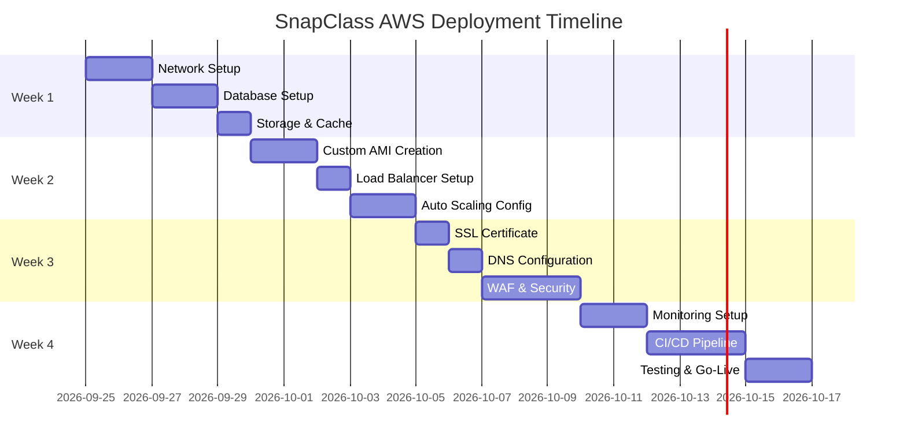

# Quick Start Guide - AWS Deployment

This guide provides a streamlined path to deploy SnapClass AI Attendance to AWS in production.

## Overview

**Estimated Time**: 4 weeks  
**Difficulty**: Advanced  
**Cost**: ~$370-670/month (depending on optimization)

## Prerequisites Checklist

Before starting, ensure you have:

- [ ] AWS Account with administrative access
- [ ] AWS CLI installed and configured
- [ ] Domain name ready (DNS access required)
- [ ] GitHub repository with application code
- [ ] Basic understanding of AWS services
- [ ] SSH key pair for EC2 access
- [ ] Budget approved (~$670/month initial, ~$370/month optimized)

## Deployment Roadmap



## Phase-by-Phase Deployment

### Week 1: Infrastructure Foundation

#### Day 1-2: Network Infrastructure
**Goal**: Set up VPC, subnets, and security groups

**Steps**:
1. Create VPC (10.0.0.0/16)
2. Create 6 subnets across 2 AZs
3. Configure Internet Gateway and NAT Gateways
4. Set up route tables
5. Create security groups

**Reference**: [INFRASTRUCTURE_SETUP.md](INFRASTRUCTURE_SETUP.md) - Phase 1

**Validation**:
```bash
# Verify VPC
aws ec2 describe-vpcs --filters "Name=tag:Name,Values=snapclass-prod-vpc"

# Verify subnets
aws ec2 describe-subnets --filters "Name=vpc-id,Values=<vpc-id>"

# Test connectivity
ping <nat-gateway-ip>
```

#### Day 3-4: Database Setup
**Goal**: Deploy RDS PostgreSQL with Multi-AZ

**Steps**:
1. Create DB subnet group
2. Create parameter group
3. Launch RDS instance (db.t3.medium)
4. Configure automated backups
5. Test connectivity

**Reference**: [INFRASTRUCTURE_SETUP.md](INFRASTRUCTURE_SETUP.md) - Phase 2

**Validation**:
```bash
# Check RDS status
aws rds describe-db-instances --db-instance-identifier snapclass-prod-db

# Test connection
psql -h <rds-endpoint> -U snapclass_admin -d postgres
```

#### Day 5: Storage & Caching
**Goal**: Set up S3 and ElastiCache Redis

**Steps**:
1. Create S3 buckets
2. Configure lifecycle policies
3. Deploy ElastiCache Redis cluster
4. Test cache connectivity

**Reference**: [INFRASTRUCTURE_SETUP.md](INFRASTRUCTURE_SETUP.md) - Phases 3-4

### Week 2: Application Deployment

#### Day 1-2: Database Migration & AMI Creation
**Goal**: Migrate data and create custom AMI

**Steps**:
1. Export Supabase schema and data
2. Import to RDS PostgreSQL
3. Launch base EC2 instance
4. Install all dependencies
5. Configure application
6. Create custom AMI

**Reference**: [APPLICATION_DEPLOYMENT.md](APPLICATION_DEPLOYMENT.md) - Phases 1-2

**Critical Dependencies**:
```bash
# System packages
sudo yum install -y python3.9 cmake gcc gcc-c++ libX11-devel

# Python packages
pip install streamlit dlib face_recognition librosa resemblyzer
```

#### Day 3: Load Balancer Setup
**Goal**: Configure ALB with target groups

**Steps**:
1. Create target group
2. Create Application Load Balancer
3. Configure health checks
4. Test load balancing

**Reference**: [APPLICATION_DEPLOYMENT.md](APPLICATION_DEPLOYMENT.md) - Phase 3

#### Day 4-5: Auto Scaling Configuration
**Goal**: Set up Auto Scaling Group

**Steps**:
1. Create launch template
2. Create Auto Scaling Group (min: 2, max: 6)
3. Configure scaling policies
4. Test scaling behavior

**Reference**: [APPLICATION_DEPLOYMENT.md](APPLICATION_DEPLOYMENT.md) - Phase 4

### Week 3: Security & SSL

#### Day 1: SSL Certificate
**Goal**: Request and validate SSL certificate

**Steps**:
1. Request certificate in ACM
2. Add DNS validation records
3. Wait for validation
4. Configure HTTPS listener on ALB

**Reference**: [APPLICATION_DEPLOYMENT.md](APPLICATION_DEPLOYMENT.md) - Phase 3, Step 3

**Important**: DNS validation can take 30 minutes to several hours

#### Day 2: DNS Configuration
**Goal**: Point domain to AWS infrastructure

**Steps**:
1. Create Route 53 hosted zone
2. Configure A record to ALB
3. Set up health checks
4. Update domain registrar nameservers

**Reference**: [APPLICATION_DEPLOYMENT.md](APPLICATION_DEPLOYMENT.md) - Phase 5

#### Day 3-5: WAF & Security Hardening
**Goal**: Implement comprehensive security

**Steps**:
1. Create WAF Web ACL
2. Configure WAF rules
3. Associate WAF with ALB
4. Set up AWS Shield
5. Configure Security Hub
6. Implement secrets management

**Reference**: [AWS_DEPLOYMENT_PLAN.md](AWS_DEPLOYMENT_PLAN.md) - Security Implementation

### Week 4: Operations & CI/CD

#### Day 1-2: Monitoring Setup
**Goal**: Implement comprehensive monitoring

**Steps**:
1. Create CloudWatch dashboards
2. Configure alarms
3. Set up log aggregation
4. Configure SNS notifications
5. Test alerting

**Reference**: [AWS_DEPLOYMENT_PLAN.md](AWS_DEPLOYMENT_PLAN.md) - Monitoring & Alerting

**Critical Alarms**:
- RDS CPU > 90%
- ALB 5xx errors > 50
- No healthy targets
- Application crashes

#### Day 3-5: CI/CD Pipeline
**Goal**: Automate deployments

**Steps**:
1. Prepare repository (buildspec.yml, appspec.yml)
2. Set up CodeBuild
3. Configure CodeDeploy
4. Create CodePipeline
5. Test complete pipeline

**Reference**: [CICD_SETUP.md](CICD_SETUP.md)

**Pipeline Stages**:
1. Source (GitHub)
2. Build (CodeBuild)
3. Test (Automated)
4. Approval (Manual)
5. Deploy (CodeDeploy)

#### Day 6-7: Testing & Go-Live
**Goal**: Validate and launch

**Steps**:
1. Load testing
2. Security audit
3. Backup verification
4. Disaster recovery test
5. Go-live checklist
6. Production launch

## Essential Commands Reference

### Infrastructure Management

```bash
# Check VPC
aws ec2 describe-vpcs --filters "Name=tag:Name,Values=snapclass-prod-vpc"

# Check RDS
aws rds describe-db-instances --db-instance-identifier snapclass-prod-db

# Check Auto Scaling
aws autoscaling describe-auto-scaling-groups --auto-scaling-group-names snapclass-asg

# Check Load Balancer
aws elbv2 describe-load-balancers --names snapclass-alb

# Check target health
aws elbv2 describe-target-health --target-group-arn <tg-arn>
```

### Application Management

```bash
# SSH to instance (via bastion)
ssh -i key.pem ec2-user@<instance-ip>

# Check application status
sudo systemctl status snapclass.service

# View logs
sudo journalctl -u snapclass.service -f

# Restart application
sudo systemctl restart snapclass.service

# Check health
curl http://localhost:8502/healthz
```

### Database Management

```bash
# Connect to RDS
psql -h <rds-endpoint> -U snapclass_admin -d snapclass

# Create backup
aws rds create-db-snapshot \
  --db-instance-identifier snapclass-prod-db \
  --db-snapshot-identifier snapclass-manual-$(date +%Y%m%d)

# List backups
aws rds describe-db-snapshots \
  --db-instance-identifier snapclass-prod-db
```

### Monitoring

```bash
# View CloudWatch logs
aws logs tail /aws/ec2/snapclass/application --follow

# Get metrics
aws cloudwatch get-metric-statistics \
  --namespace AWS/EC2 \
  --metric-name CPUUtilization \
  --dimensions Name=AutoScalingGroupName,Value=snapclass-asg \
  --start-time $(date -u -d '1 hour ago' +%Y-%m-%dT%H:%M:%S) \
  --end-time $(date -u +%Y-%m-%dT%H:%M:%S) \
  --period 300 \
  --statistics Average
```

## Common Issues & Solutions

### Issue: RDS Connection Timeout
**Solution**:
```bash
# Check security group
aws ec2 describe-security-groups --group-ids <rds-sg-id>

# Verify EC2 can reach RDS
telnet <rds-endpoint> 5432
```

### Issue: Application Won't Start
**Solution**:
```bash
# Check logs
sudo journalctl -u snapclass.service -n 100

# Verify environment variables
sudo systemctl show snapclass.service --property=Environment

# Test configuration
source /opt/snapclass/scripts/load_config.sh
```

### Issue: Health Check Failing
**Solution**:
```bash
# Test health endpoint
curl -v http://localhost:8502/healthz

# Check health service
sudo systemctl status snapclass-health.service

# Review health check logs
sudo journalctl -u snapclass-health.service -n 50
```

### Issue: High Costs
**Solution**:
1. Review CloudWatch metrics for underutilized resources
2. Consider Reserved Instances for EC2 and RDS
3. Implement S3 Intelligent-Tiering
4. Use Spot Instances for non-critical workloads
5. Schedule scaling down during off-peak hours

## Cost Optimization Tips

### Immediate Savings (0-30 days)
- [ ] Right-size EC2 instances based on actual usage
- [ ] Enable S3 Intelligent-Tiering
- [ ] Configure Auto Scaling to scale down during off-hours
- [ ] Delete unused EBS snapshots
- [ ] Remove old CloudWatch logs

### Medium-term Savings (1-3 months)
- [ ] Purchase 1-year Reserved Instances (30-40% savings)
- [ ] Implement CloudFront caching to reduce origin requests
- [ ] Use RDS Reserved Instances
- [ ] Optimize database queries to reduce RDS size
- [ ] Implement application-level caching

### Long-term Savings (3+ months)
- [ ] Consider 3-year Reserved Instances (50-60% savings)
- [ ] Implement Savings Plans
- [ ] Use Spot Instances for batch processing
- [ ] Optimize application code for efficiency
- [ ] Consider multi-region deployment for better pricing

## Security Checklist

- [ ] All data encrypted at rest (RDS, S3, EBS)
- [ ] All data encrypted in transit (TLS 1.2+)
- [ ] Security groups follow least privilege
- [ ] IAM roles use minimal permissions
- [ ] MFA enabled on AWS root account
- [ ] CloudTrail logging enabled
- [ ] GuardDuty enabled
- [ ] Security Hub enabled
- [ ] WAF rules configured
- [ ] Regular security audits scheduled
- [ ] Secrets stored in Secrets Manager
- [ ] No hardcoded credentials
- [ ] VPC Flow Logs enabled
- [ ] Regular backup testing
- [ ] Incident response plan documented

## Go-Live Checklist

### Pre-Launch (1 week before)
- [ ] All infrastructure deployed and tested
- [ ] SSL certificate validated
- [ ] DNS configured and tested
- [ ] Monitoring and alerting configured
- [ ] CI/CD pipeline tested
- [ ] Load testing completed
- [ ] Security audit passed
- [ ] Backup and restore tested
- [ ] Disaster recovery plan documented
- [ ] Team trained on operations

### Launch Day
- [ ] Final backup of current system
- [ ] DNS cutover planned
- [ ] Rollback plan ready
- [ ] Team on standby
- [ ] Monitoring dashboards open
- [ ] Communication plan ready
- [ ] Execute DNS cutover
- [ ] Monitor for 2 hours
- [ ] Verify all functionality
- [ ] Announce successful launch

### Post-Launch (First Week)
- [ ] Monitor metrics daily
- [ ] Review logs for errors
- [ ] Optimize based on actual usage
- [ ] Gather user feedback
- [ ] Document any issues
- [ ] Update runbooks
- [ ] Schedule retrospective

## Support Resources

### AWS Documentation
- [EC2 User Guide](https://docs.aws.amazon.com/ec2/)
- [RDS User Guide](https://docs.aws.amazon.com/rds/)
- [ELB User Guide](https://docs.aws.amazon.com/elasticloadbalancing/)
- [Auto Scaling Guide](https://docs.aws.amazon.com/autoscaling/)

### Project Documentation
- [Full Deployment Plan](AWS_DEPLOYMENT_PLAN.md)
- [Infrastructure Setup](INFRASTRUCTURE_SETUP.md)
- [Application Deployment](APPLICATION_DEPLOYMENT.md)
- [CI/CD Setup](CICD_SETUP.md)

### Getting Help
- AWS Support (if you have a support plan)
- AWS Forums
- Stack Overflow (tag: amazon-web-services)
- Project team communication channel

## Next Steps After Deployment

1. **Week 1-2**: Monitor closely, optimize based on actual usage
2. **Month 1**: Implement cost optimizations
3. **Month 2**: Consider Reserved Instances
4. **Month 3**: Review and update disaster recovery plan
5. **Ongoing**: Regular security audits and updates

---

**Ready to start?** Begin with [INFRASTRUCTURE_SETUP.md](INFRASTRUCTURE_SETUP.md) Phase 1.

**Questions?** Review the [Full Deployment Plan](AWS_DEPLOYMENT_PLAN.md) for detailed information.

---

**Document Version**: 1.0  
**Last Updated**: 2026-09-25